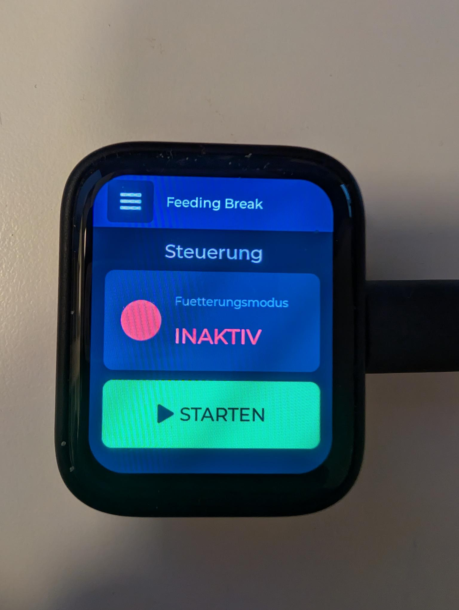
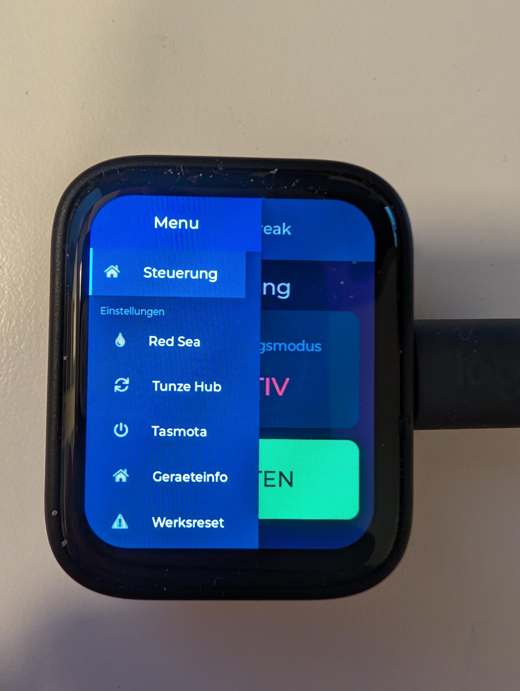
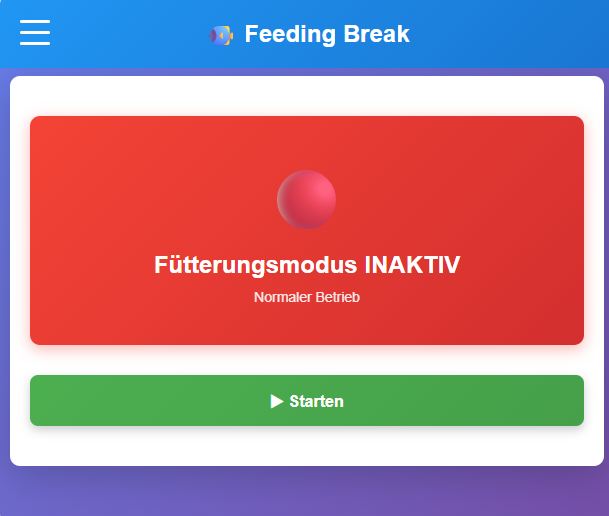
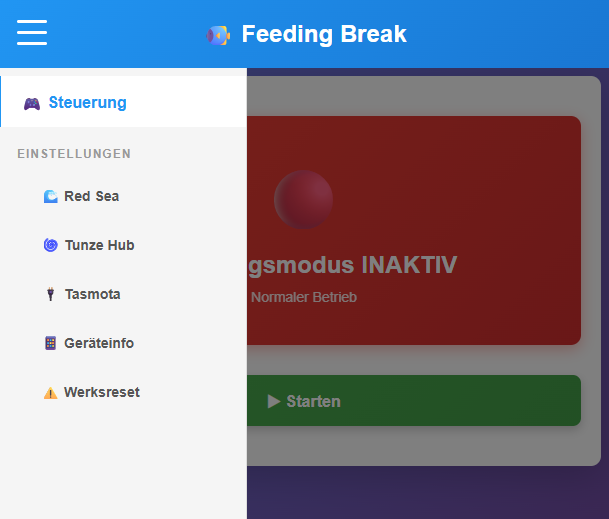

# Feeding Break Controller

Smart feeding mode controller for aquarium systems with touch display support.

> **Note:** This project was generated with assistance from GitHub Copilot (Claude Sonnet 4.5)

## 📸 Screenshots

### Touch Display Interface
| Main Screen | Menu |
|-------------|------|
|  |  |

### Web Interface
| Dashboard | Settings |
|-----------|----------|
|  |  |

## 🌟 Features

- **Touch Display Interface** - Beautiful LVGL-based UI
- **Multi-Platform Support** 
  - Red Sea ReefBeat Cloud Integration
  - Tunze Smart Hub Integration
  - Tasmota Device Control
- **WiFi Management** - Easy setup via captive portal
- **Web Interface** - Full configuration via browser
- **Auto-Reconnect** - Reliable network handling
- **Screensaver** - Configurable display timeout

## 🔧 Supported Hardware

### Displays
- **ESP32-4848S040** - JCZN 4.0" 480x480 RGB Touch Panel
- **Waveshare ESP32-S3-Touch-AMOLED-1.8** - 1.8" 368x448 AMOLED

### Features by Board
| Feature | ESP32-4848S040 | Waveshare AMOLED |
|---------|---------------|------------------|
| Display | 480x480 RGB | 368x448 AMOLED |
| Touch | GT911 | FT3168 |
| Relays | 3x | - |
| WiFi | ✓ | ✓ |
| Web UI | ✓ | ✓ |

## 📦 Installation

### Prerequisites
- [PlatformIO](https://platformio.org/) (recommended) or Arduino IDE
- ESP32 board support

### Quick Start

1. **Clone the repository**
```bash
git clone https://github.com/mistljo/feeding_break.git
cd feeding_break
```

2. **Open in PlatformIO**
```bash
code .  # VS Code with PlatformIO extension
```

3. **Select your board**
   - For ESP32-4848S040: Use environment `esp32s3`
   - For Waveshare AMOLED: Use environment `waveshare_amoled`

4. **Build and Upload**
```bash
# For ESP32-4848S040
pio run --target upload --environment esp32s3

# For Waveshare AMOLED
pio run --target upload --environment waveshare_amoled
```

5. **Configure WiFi**
   - On first boot, device creates WiFi AP "FeedingBreak_Setup"
   - Connect with password: `ChangeMe123!` (change this in `src/config.h`!)
   - Follow setup wizard on touch screen

## ⚙️ Configuration

### WiFi Setup
1. Touch display will show WiFi setup on first boot
2. OR: Connect to AP and visit http://192.168.4.1
3. Enter your WiFi credentials

### Cloud Services
Configure via Web Interface (http://YOUR_DEVICE_IP/):

#### Red Sea ReefBeat
- Email/Username
- Password
- Select Aquarium

#### Tunze Smart Hub
- Email/Username
- Password
- Select Device

#### Tasmota Devices
- Add device URLs
- Configure pulse time (auto-on after feeding)

## 🖥️ Web Interface

Access at `http://YOUR_DEVICE_IP/`

Features:
- Start/Stop feeding mode
- Configure cloud services
- Device information
- WiFi settings
- Factory reset

## 🔒 Security

**This repository is safe for public sharing:**
- ✅ No hardcoded passwords
- ✅ No WiFi credentials in code
- ✅ All credentials stored in ESP32 Flash (Preferences)
- ✅ Configured at runtime via Web/Touch UI

**Before Deployment:**
1. Change default AP password in `src/config.h`
2. Use strong passwords when configuring services
3. Keep Web Interface secure (consider adding authentication)

## 📁 Project Structure

```
feeding_break/
├── src/
│   ├── main.cpp              # Main application
│   ├── config.h              # API endpoints & defaults (NO SECRETS!)
│   ├── credentials.h         # Credential management (Flash storage)
│   ├── board_config.h        # Hardware pin definitions
│   ├── display_lvgl.h        # Display & touch driver
│   ├── menu_ui.h             # Main menu interface
│   ├── wifi_ui.h             # WiFi setup interface
│   ├── redsea_api.h          # Red Sea API integration
│   ├── tunze_api.h           # Tunze API integration
│   └── tasmota_api.h         # Tasmota device control
├── platformio.ini            # Build configuration
└── README.md                 # This file
```

## 🐛 Troubleshooting

### Display not responding
- Check `platformio.ini` for correct board selection
- Verify board define: `-DBOARD_ESP32_4848S040` or `-DBOARD_WAVESHARE_AMOLED_1_8`

### WiFi won't connect
- Factory reset: Hold button for 10 seconds (if available) or use Web UI
- Check Serial Monitor for connection details

### Touch not working (Waveshare AMOLED)
- FT3168 controller may not respond properly
- Touch will auto-disable after 5 failed attempts
- Use Web Interface as alternative

### I2C Errors (Waveshare)
- Log level set to WARN to reduce spam
- Touch controller errors are normal if not properly initialized
- System remains functional via Web Interface

## 🤝 Contributing

Contributions are welcome! Please:
1. Fork the repository
2. Create a feature branch
3. Commit your changes
4. Push to the branch
5. Create a Pull Request

## 📄 License

This project is open source. Please add your preferred license here.

## 🙏 Acknowledgments

- [LVGL](https://lvgl.io/) - Embedded graphics library
- [Arduino_GFX](https://github.com/moononournation/Arduino_GFX_Library) - Display driver
- [ESPAsyncWebServer](https://github.com/mathieucarbou/ESPAsyncWebServer) - Async web server
- [ArduinoJson](https://arduinojson.org/) - JSON library

## 📧 Support

- GitHub Issues: For bug reports and feature requests
- Discussions: For questions and community support

---

**Made with ❤️ for the aquarium community**
